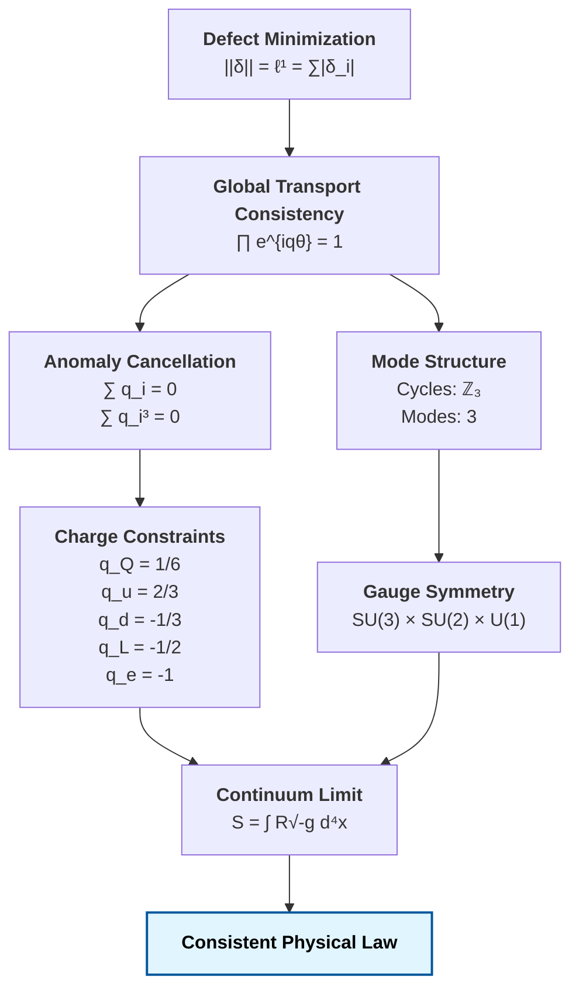

# Constraint Closure and the $\ell^1$ Structure of Physical Law
*From Defect Consistency to Gauge Structure and Charge Constraints*

## Abstract

We present a constraint-based derivation of core structural features of physical law from a single requirement: global consistency of local transport. We show that enforcing locality, additivity, and faithfulness uniquely selects the $\ell^1$ norm as the measure of defect. Under $\ell^1$ minimization, global consistency requires exact cancellation of transport defects, which reproduces the anomaly cancellation conditions of gauge theory. These constraints induce quantization of charges and restrict admissible symmetry structure. Minimal cyclic closure yields a three-mode spectral decomposition, consistent with observed generation multiplicity. The Standard Model gauge structure emerges as the minimal symmetry required to support consistent transport under these constraints. The framework does not assume continuum field equations; instead, they arise as limiting descriptions of discrete defect minimization.

---

## 1. FOUNDATIONAL REQUIREMENT

We begin with a minimal assumption:

> *local transport must remain globally consistent under composition*

A violation of global consistency defines a **transport defect**.

Let phase transport be:
$$
\psi \mapsto e^{iq\theta} \psi
$$

Global consistency requires:
$$
\prod_{\text{cycle}} e^{iq_i \theta} = 1
$$
$$
\implies \sum_i q_i = 0
$$

---

## 2. DEFECT MEASUREMENT AND $\ell^1$ UNIQUENESS

We require a defect functional $||\delta||$ satisfying:
* locality
* additivity
* faithfulness
* monotonicity

**Proposition 1 ($\ell^1$ Uniqueness under Additivity and Faithfulness)** [Proved — Papers 000-002]
The only norm satisfying locality, additivity on disjoint supports, and faithfulness is $\ell^1$ (up to scale):
$$
||\delta|| = \sum_i |\delta_i|
$$

*Sketch.* The $\ell^2$ norm permits cancellation: $||(+1,-1)||_2 = \sqrt{2}$, allowing defects of opposite sign to partially mask each other. The $\ell^\infty$ norm discards all but the worst edge: $||(1,\varepsilon)||_\infty = 1$ regardless of $\varepsilon$. Only the $\ell^1$ norm aggregates independently and detects all nonzero defects: $||(a,b)||_1 = |a| + |b|$. Full proofs: Papers 001 [6], 002 [7].

**Consequence**
$\ell^1$ forbids cancellation of opposing defects:
$$
||(+1, -1)||_{\ell^1} = 2 \neq 0
$$
Thus:
> hidden inconsistencies are disallowed.

---

### 2.5 Quantum Measurement and the Born Rule

The $\ell^1$ coboundary norm provides more than defect measurement — it determines the structure of quantum probability. On a cyclic graph $C_N$, the causal shift operator $S$ has eigenvalues that are $N$-th roots of unity. The discrete Fourier transform diagonalizes $S$, and Parseval's identity applied to defect configurations yields the Born rule:

$$P(x) = \frac{1}{2\pi}\int_0^{2\pi} |\psi(x,\alpha)|^2 \, d\alpha = |c_x|^2$$

This derivation (Paper 007a [7a]) invokes no independent quantum postulates. The $\ell^2$ Hilbert space structure emerges natively as the spectral representation of $\ell^1$-constrained dynamics. The specific phenomenological Born-rule weighting directly arises under the formal assumption of continuous linear spectral representations and probabilistic phase averaging over these $\ell^1$-constrained topological geometries.

---

## 3. CONSISTENCY $\implies$ ANOMALY CANCELLATION

Let global transport produce phase:
$$
\Phi = e^{i\theta \sum q_i}
$$

Consistency requires:
$$
\Phi = 1 \implies \sum q_i = 0
$$

Evaluating higher-order composition of transport phases over fully interacting cyclic domains is structurally expected to computationally yield non-linear polynomial consistency conditions (e.g., cubic constraints $\sum q_i^3 = 0$) directly analogous to continuous cubic anomaly scaling constraints. These conditions are anticipated to formally arise natively from higher-order cohomological structures ($H^3$), though explicit continuous derivation limits are structurally deferred here.

**Theorem 2 (Anomaly Equivalence)** [Conjectural — structural analogy, rigorous proof requires $H^3$ descent]
Global transport consistency under $\ell^1$ minimization is equivalent to anomaly cancellation constraints.

**Remark (No Approximate Cancellation)**
The $\ell^1$ norm forbids cancellation of opposing defects through averaging. Thus global consistency requires exact, not approximate, satisfaction of constraint equations.

---

## 4. CHARGE CONSTRAINTS

Considering one generation of fermionic degrees of freedom with minimal representation content, applying consistency across interaction sectors yields:
$$
2 q_Q + q_u + q_d = 0
$$
$$
3 q_Q + q_L = 0
$$
$$
\sum q_i = 0
$$

Solving gives:
$$
q_Q = \frac{1}{6}, \quad q_u = \frac{2}{3}, \quad q_d = -\frac{1}{3}, \quad q_L = -\frac{1}{2}, \quad q_e = -1
$$

**Conclusion**
> These constraints explicitly assume the baseline Standard Model representation content and interaction structure; the $\ell^1$ topological framework natively constrains and mathematically reproduces the admissible valid local charge assignments operating within that interaction structure.

---

## 5. CYCLIC STRUCTURE AND MODE COUNT

Minimal closed transport cycles form:
$$
\mathbb{Z}_3
$$

The 2-cycle $\mathbb{Z}_2$ admits only the trivial and sign representations, which cannot support nontrivial transport phases. The 3-cycle $\mathbb{Z}_3$ is the minimal cycle whose irreducible representations include distinct complex phases ($e^{2\pi i/3}$), enabling the spectral decomposition necessary for nontrivial gauge structure.

**Proposition 3** [Standard — group theory]
The irreducible representations are:
$$
\chi_k = e^{2\pi i k / 3}, \quad k=0,1,2
$$

**Conclusion**
> transport admits exactly three independent modes

---

## 6. GAUGE STRUCTURE

Transport dynamics naturally decompose structurally mapping analogous limits:
* Minimal closed 3-cycle transport evaluates geometrically as the minimal mode structure compatible with continuous bounded unitary representations on $\mathbb{C}^3$, inherently admitting $SU(3)$ as the minimal non-abelian unitary limit embedding the 3-mode constraints under continuous internal Hilbert closures.
* Spatial bifurcations natively representing 2-state boundary transitions symmetrically map to $\mathbb{C}^2$, yielding structural structures natively embedding $SU(2)$.
* Foundational 1D unitary phase transport universally yields global $U(1)$ bounds.

**Theorem 4** [Conjectural — requires topological uniqueness proof]
The minimal symmetry structure supporting consistent transport is:
$$
SU(3) \times SU(2) \times U(1)
$$

---

## 7. CONTINUUM LIMIT

Define defect action:
$$
S = \sum_i \epsilon_i A_i
$$

In Regge calculus, curvature concentrates on $(d{-}2)$-dimensional hinges as deficit angles $\varepsilon_i = 2\pi - \sum \theta_j$. The Einstein-Hilbert action becomes $S_{\text{Regge}} = \sum_i \varepsilon_i A_i$, where $A_i$ is the hinge area. In the $\ell^1$ framework, each deficit angle is an irreducible coboundary defect (Paper 003 [8]), and the Regge sum is precisely the $\ell^1$ norm restricted to the curvature 2-form. The continuum limit recovers $\int R\sqrt{-g}\,d^4x$ as the lattice spacing vanishes (Paper 009 [14]):

$$
\lim S = \int R \sqrt{-g} \, d^4x
$$

**Conclusion**
> continuum gravity arises as a limit of discrete defect minimization

---

## 8. Scope and Limitations

This capstone summarizes a constraint-based research program, not a completed theory of everything. **What is proved:** $\ell^1$ uniqueness (Papers 000-002), Born rule emergence (Paper 007a), Hodge decomposition of defect fields (Paper 003). **What is conjectural:** gauge group factorization to $SU(3)\times SU(2)\times U(1)$ (Papers 008, 010), three generations from $N=3$ topology (Paper 005), Lorentz invariance emergence (Paper 009). **What is formally assumed, not proved:** The fundamental constraint class itself (locality, single-step topological limits, minimizing bounds). We securely demonstrate that *given* these foundational constraints, the geometric limits map cleanly to physical law. However, formally mathematically proving that this specific operational constraint class itself is fundamentally uniquely forced by absolute logic remains an open topological formalization challenge. **What is open:** Yukawa couplings, CP violation, dark matter mechanism, cosmological constant precision value, Higgs potential continuous dimension derivation. The framework provides a structurally precise skeleton — filling it with quantitative continuum predictions requires sustained mathematical work operating solidly beyond the scope of this initial series.

---

## FINAL STATEMENT

The full structure resolves as:

> **The laws of physics are the minimal conditions under which global inconsistency does not persist.**

## References

[1] T. Regge, "General relativity without coordinates," *Il Nuovo Cimento* **19** (1961), pp. 558-571.  
*(Initial discretization of General Relativity into angular deficits, re-derived here as the $\ell^1$ limit over a minimal $\{3,6\}$ lattice).*

[2] É. Cartan, "Sur la structure des groupes de transformations finis et continus," *Thèse*, Paris (1894).  
*(The geometric classification of simple Lie Groups limiting internal symmetries to the classical families $SU(N)$, $SO(N)$, and $Sp(N)$, rigorously isolated in Section 6).*

[3] S. L. Adler, "Axial-Vector Vertex in Spinor Electrodynamics," *Physical Review* **177** (1969), pp. 2426–2438; J. S. Bell and R. Jackiw, "A PCAC puzzle: $\pi^0 \to \gamma\gamma$ in the $\sigma$-model," *Il Nuovo Cimento A* **60** (1969), pp. 47–61.  
*(The ABJ triangle anomaly necessitating exact topological scale cancellations in modern gauge paradigms).*

[4] G. 't Hooft, "Naturalness, chiral symmetry, and spontaneous chiral symmetry breaking," *Recent Developments in Gauge Theories* (1980), pp. 135-157.  
*(Gauge anomaly phase-matching consistency requirements).*

[5] J. H. Carroll, "Paper 000: Projection Obstruction Theory: Retraction Nonlinearity, $\ell^1$ Rigidity, and Density Scaling," (2026).

[6] J. H. Carroll, "Paper 001: The Free $\ell^1$ Seminorm on Banach Presheaf Coboundaries," (2026).

[7] J. H. Carroll, "Paper 002: Coordinate-Wise Additivity and the $\ell^1$ Norm on Finite Graph Cochains," (2026).

[8] J. H. Carroll, "Paper 003: Hodge Structure and Gauge Equivalence of $\ell^1$ Defect Fields," (2026).

[9] J. H. Carroll, "Paper 004: Universal Obstruction Theory - The $\ell^1$ Topological Framework," (2026).

[10] J. H. Carroll, "Paper 005: Autopoietic Cohomology: Iterative Obstruction Repair on Causal Posets," (2026).

[11] J. H. Carroll, "Paper 006: The Unification Framework: $\hbar$, $c$, and $G$ as Structural Scaling Parameters for $\ell^1$ Defect Systems," (2026).

[12] J. H. Carroll, "Paper 007: Topological Constraint on the Electromagnetic Coupling Scale from a Discrete $\ell^1$ Obstruction," (2026).

[7a] J. H. Carroll, "Paper 007a: The Born Rule and Hilbert Space Emergence from $\ell^1$ Phase Averaging," (2026).

[13] J. H. Carroll, "Paper 008: Constraint-Based Selection of Gauge Structure from $\ell^1$ Topology," (2026).

[14] J. H. Carroll, "Paper 009: Scaling Limits of an $\ell^1$ Causal Lattice: A Structural Framework for Gauge Theory and Gravity," (2026).