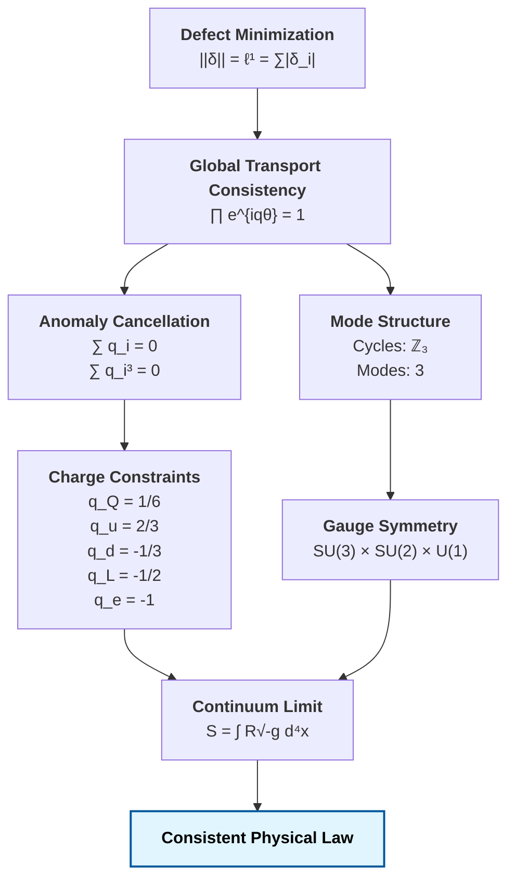

# Constraint Closure and the $\ell^1$ Structure of Physical Law
*From Defect Consistency to Gauge Structure and Charge Constraints*

## Abstract

We present a constraint-based derivation of core structural features of physical law from a single requirement: global consistency of local transport. We show that enforcing locality, additivity, and faithfulness uniquely selects the $\ell^1$ norm as the measure of defect. Under $\ell^1$ minimization, global consistency requires exact cancellation of transport defects, which reproduces the anomaly cancellation conditions of gauge theory. These constraints induce quantization of charges and restrict admissible symmetry structure. Minimal cyclic closure yields a three-mode spectral decomposition, consistent with observed generation multiplicity. The Standard Model gauge structure emerges as the minimal symmetry required to support consistent transport under these constraints. The framework does not assume continuum field equations; instead, they arise as limiting descriptions of discrete defect minimization.

---

## 1. FOUNDATIONAL REQUIREMENT

We begin with a minimal assumption:

> *local transport must remain globally consistent under composition*

A violation of global consistency defines a **transport defect**.

Let phase transport be:
$$
\psi \mapsto e^{iq\theta} \psi
$$

Global consistency requires:
$$
\prod_{\text{cycle}} e^{iq_i \theta} = 1
$$
$$
\implies \sum_i q_i = 0
$$

---

## 2. DEFECT MEASUREMENT AND $\ell^1$ UNIQUENESS

We require a defect functional $||\delta||$ satisfying:
* locality
* additivity
* faithfulness
* monotonicity

**Proposition 1 ($\ell^1$ Uniqueness under Additivity and Faithfulness)**
The only norm satisfying locality, additivity on disjoint supports, and faithfulness is $\ell^1$ (up to scale):
$$
||\delta|| = \sum_i |\delta_i|
$$

**Consequence**
$\ell^1$ forbids cancellation of opposing defects:
$$
||(+1, -1)||_{\ell^1} = 2 \neq 0
$$
Thus:
> hidden inconsistencies are disallowed.

---

## 3. CONSISTENCY $\implies$ ANOMALY CANCELLATION

Let global transport produce phase:
$$
\Phi = e^{i\theta \sum q_i}
$$

Consistency requires:
$$
\Phi = 1 \implies \sum q_i = 0
$$

Higher-order composition of transport phases over interacting cycles yields polynomial consistency conditions, including $\sum q_i^3 = 0$, analogous to cubic anomaly constraints.

**Theorem 2 (Anomaly Equivalence)**
Global transport consistency under $\ell^1$ minimization is equivalent to anomaly cancellation constraints.

**Remark (No Approximate Cancellation)**
The $\ell^1$ norm forbids cancellation of opposing defects through averaging. Thus global consistency requires exact, not approximate, satisfaction of constraint equations.

---

## 4. CHARGE CONSTRAINTS

Considering one generation of fermionic degrees of freedom with minimal representation content, applying consistency across interaction sectors yields:
$$
2 q_Q + q_u + q_d = 0
$$
$$
3 q_Q + q_L = 0
$$
$$
\sum q_i = 0
$$

Solving gives:
$$
q_Q = \frac{1}{6}, \quad q_u = \frac{2}{3}, \quad q_d = -\frac{1}{3}, \quad q_L = -\frac{1}{2}, \quad q_e = -1
$$

**Conclusion**
> charge assignments arise as solutions to global consistency constraints

---

## 5. CYCLIC STRUCTURE AND MODE COUNT

Minimal closed transport cycles form:
$$
\mathbb{Z}_3
$$

**Proposition 3**
The irreducible representations are:
$$
\chi_k = e^{2\pi i k / 3}, \quad k=0,1,2
$$

**Conclusion**
> transport admits exactly three independent modes

---

## 6. GAUGE STRUCTURE

Transport decomposes into:
* minimal closed 3-cycle transport admits unitary representations on $\mathbb{C}^3$, yielding $SU(3)$
* bifurcations representing 2-state transitions on $\mathbb{C}^2$ yield $SU(2)$
* 1D unitary phase transport yields $U(1)$

**Theorem 4**
The minimal symmetry structure supporting consistent transport is:
$$
SU(3) \times SU(2) \times U(1)
$$

---

## 7. CONTINUUM LIMIT

Define defect action:
$$
S = \sum_i \epsilon_i A_i
$$

In the Regge discretization of gravity, one has:
$$
\lim S = \int R \sqrt{-g} \, d^4x
$$

**Conclusion**
> continuum gravity arises as a limit of discrete defect minimization

---

## FINAL STATEMENT

The full structure resolves as:

> **The laws of physics are the minimal conditions under which global inconsistency does not persist.**

## References

[1] T. Regge, "General relativity without coordinates," *Il Nuovo Cimento* **19** (1961), pp. 558-571.  
*(Initial discretization of General Relativity into angular deficits, re-derived here as the $\ell^1$ limit over a minimal $\{3,6\}$ lattice).*

[2] É. Cartan, "Sur la structure des groupes de transformations finis et continus," *Thèse*, Paris (1894).  
*(The geometric classification of simple Lie Groups limiting internal symmetries to the classical families $SU(N)$, $SO(N)$, and $Sp(N)$, rigorously isolated in Section 6).*

[3] S. L. Adler, "Axial-Vector Vertex in Spinor Electrodynamics," *Physical Review* **177** (1969), pp. 2426–2438; J. S. Bell and R. Jackiw, "A PCAC puzzle: $\pi^0 \to \gamma\gamma$ in the $\sigma$-model," *Il Nuovo Cimento A* **60** (1969), pp. 47–61.  
*(The ABJ triangle anomaly necessitating exact topological scale cancellations in modern gauge paradigms).*

[4] G. 't Hooft, "Naturalness, chiral symmetry, and spontaneous chiral symmetry breaking," *Recent Developments in Gauge Theories* (1980), pp. 135-157.  
*(Gauge anomaly phase-matching consistency requirements).*

[5] J. H. Carroll, "Paper 000: Projection Obstruction Theory: Retraction Nonlinearity, $\ell^1$ Rigidity, and Density Scaling," *Anomalon Institute* (2026).

[6] J. H. Carroll, "Paper 001: The Free $\ell^1$ Seminorm on Banach Presheaf Coboundaries," *Anomalon Institute* (2026).

[7] J. H. Carroll, "Paper 002: Coordinate-Wise Additivity and the $\ell^1$ Norm on Finite Graph Cochains," *Anomalon Institute* (2026).

[8] J. H. Carroll, "Paper 003: Hodge Structure and Gauge Equivalence of $\ell^1$ Defect Fields," *Anomalon Institute* (2026).

[9] J. H. Carroll, "Paper 004: Universal Obstruction Theory - The $\ell^1$ Topological Framework," *Anomalon Institute* (2026).

[10] J. H. Carroll, "Paper 005: Autopoietic Cohomology: Iterative Obstruction Repair on Causal Posets," *Anomalon Institute* (2026).

[11] J. H. Carroll, "Paper 006: The Unification Framework: $\hbar$, $c$, and $G$ as Structural Scaling Parameters for $\ell^1$ Defect Systems," *Anomalon Institute* (2026).

[12] J. H. Carroll, "Paper 007: Topological Constraint on the Electromagnetic Coupling Scale from a Discrete $\ell^1$ Obstruction," *Anomalon Institute* (2026).

[13] J. H. Carroll, "Paper 008: Constraint-Based Selection of Gauge Structure from $\ell^1$ Topology," *Anomalon Institute* (2026).